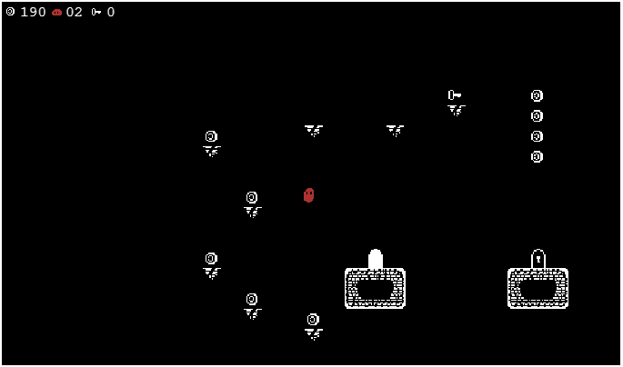

# Forgotten

#### A retro-styled 2D platformer game built in Phaser 3

#### Preamble

This is a short platformer game that I made for two main reasons:

1. To work out how to use Phaser 3

2. To understand what Webpack is

I find that I am much more *au fait* with both technologies now, and I have learnt a lot. It is only a short game, but I tried to fill it with all the standard platformer staples. I got to play with particle effects and compile HTML templates. 

#### Installation & use

Download everything, and then run "npm install" from the command line in the relevant place. 

- "npm run build" will pack all the source files together and output a playable game in /dist

- "npm run serve" will start a dev server so you can make changes and watch them appear immediately at localhost:8080

#### Playing

- Arrow keys to control the blob
- Space to move on from menus
- M to mute/unmute

Collect coins, lives and keys as you navigate through 8 levels displaying the various available mechanics. There is wall-jumping, if you're into that kind of thing.

#### Adding levels

Currently there are only eight levels, but it is easy to add more. Build your own using Tiled and the base_level file in /src/assets/levels. Name it level_[next number] 
